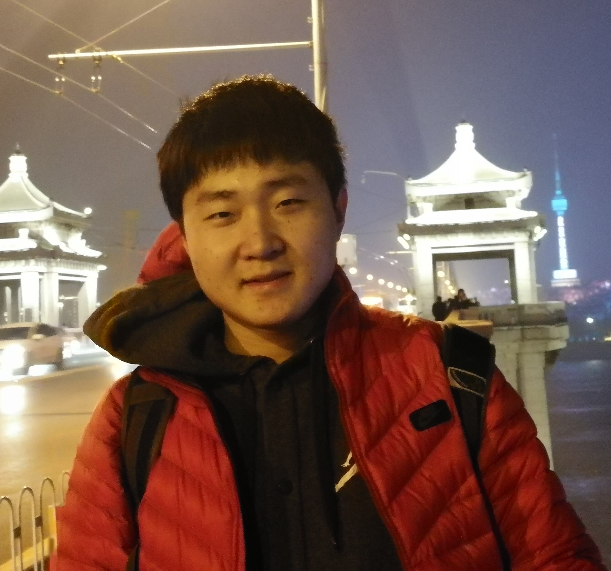

## Zhiyi Chen

<table border="0" frame=void>
  <tr>
    <td width="75%">
      
<b>Ph.D. Student</b>

      
Office: Klaus Advanced Computer Building, room 3337

      
Email: zchen798 AT gatech DOT edu

    </td>
    <td width="25%">
      
    </td>
  </tr>
</table>

### About Me

I am a third year Ph.D. Candidate in Computer Science at Georgia Tech, advised by Prof. Alberto Dainotti. I am interested in intersection of machine learning and Internet measurement. Before joining Georgia Tech, I received my bachelor's degree in Department of Computer Science and Technology, Tsinghua University in 2020.

### Research Interests

Application of machine learning in data science

Internet measurement

Cybersecurity

### News

Jun, 2023: I started a research summer internship at Coalition, Inc.

Mar, 2023: I posted an APNIC Blog about my work on improving the inference of sibling Autonomous Systems. [APNIC Blog](https://blog.apnic.net/2023/03/21/improving-the-inference-of-sibling-autonomous-systems/)

Feb, 2023: The joint work with Peng Li on *DiffPrep: Differentiable Data Preprocessing Pipeline Search for Learning over Tabular Data* was accepted by the The ACM Special Interest Group on Management of Data (SIGMOD) 2023.

Feb, 2023: I presented a lightning talk on *Improving the Inference of Sibling Autonomous Systems* at NANOG 87 in Atlanta. The recording can be found at [NANOG Talk](https://youtu.be/AK9PpC8FX9E).

Jan, 2023: My work *Improving the Inference of Sibling Autonomous Systems* was accepted by the Passive and Active Measurement Conference (PAM) 2023. Our dataset won the Best Community Artifact Award.
([PDF](https://github.com/zhiyichenGT/zhiyichenGT.github.io/blob/gh-pages/Improving%20the%20Inference%20of%20Sibling%20Autonomous%20Systems%20(Accepted%20Manuscript).pdf), [Dataset](https://github.com/InetIntel/Improving-Inference-of-Sibling-ASes), [Video](https://www.youtube.com/watch?v=CcgUmsEB3xc)) 
<!-- (This version of the contribution has been accepted for publication, after peer review (when applicable) but is not the Version of Record and does not reflect post-acceptance improvements, or any corrections. The Version of Record is available online at: [Paper](https://link.springer.com/chapter/10.1007/978-3-031-28486-1_15).) -->

Jul, 2022: I presented a talk *Mapping ASNs to Organizations* at MapKIT Workshop 2022.

Aug, 2021: I joined Georgia Tech as a Ph.D. student.

Jun, 2021: My work *Principal Gradient Direction and Confidence Reservoir Sampling for Continual Learning* was accepted at 30th International Conference on Artificial Neural Networks (ICANN) 2021.

### Publications

[1] [**Improving the Inference of Sibling Autonomous Systems**](https://github.com/zhiyichenGT/zhiyichenGT.github.io/blob/gh-pages/Improving%20the%20Inference%20of%20Sibling%20Autonomous%20Systems%20(Accepted%20Manuscript).pdf)

**Zhiyi Chen**, Zachary S. Bischof, Cecilia Testart, Alberto Dainotti,  PAM 2023

[2] [**DiffPrep: Differentiable Data Preprocessing Pipeline Search for Learning over Tabular Data**](https://2023.sigmod.org/)

Peng Li, **Zhiyi Chen**, Xu Chu, Kexin Rong,  SIGMOD 2023

[3] [**Principal Gradient Direction and Confidence Reservoir Sampling for Continual Learning**](http://link.springer.com/chapter/10.1007/978-3-030-86340-1_34)

**Zhiyi Chen**, Tong Lin,  ICANN 2021
